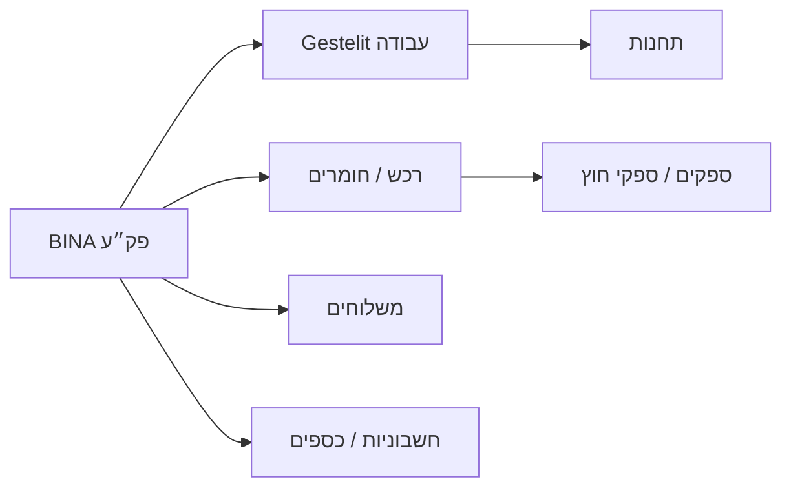

# BINA ERP to Gestelit MES Cockpit Spec

Saved: 2026-06-15

## Purpose

Gestelit should not show BINA as spreadsheets inside the app. BINA is the read-only ERP source of truth. Gestelit should become the MES execution layer that answers:

- What should the plant run now?
- What is blocked, why, and who owns the next action?
- Which BINA work orders are ready to release into Gestelit?
- Which jobs are at risk because of materials, suppliers, subcontractors, delivery, cash, or stale data?
- Which data can be trusted as complete, and which is only a recent partial sync window?

This spec builds on the existing BINA BI plan and current implementation. It is not a restart.

## What Exists Today

Implemented foundation:

- `/admin/bina` exists with tabs: `סקירה`, `פק״עות`, `רכש`, `ספקים`, `כספים`, `מכירות`, `משלוחים`, `AI`, `סנכרון`.
- The BINA sync lands JSONB raw tables and upserts by `bina_id`.
- Typed staging/mart views exist for work orders, production rows, purchasing, suppliers, finance, sales, deliveries, sync health, and overview KPIs.
- Finance is the strongest domain: date quality, balance confidence, currency grouping, aging buckets, exceptions, and detail drawer exist.
- BI aggregate/data-trust layer exists:
  - `rpc_bina_dashboard_summary`
  - `mart_bina_cross_domain_risk`
  - `mart_bina_sync_coverage`
  - `mart_bina_data_quality`
  - finance/purchase/delivery metric views
- AI tools exist and can query approved BINA domains.
- Persistent admin AI assistant exists.
- BINA import is feature-flagged/disabled by default, which is correct for now.
- Existing Gestelit MES/floor primitives exist: jobs, stations, pipeline presets, job items, status events, worker sessions, quantity reporting, QA/checklists, and live admin dashboard patterns.

Main current weakness:

- The UI still mostly mirrors ERP data domains instead of plant workflows.
- Several domain cards still compute KPIs from capped visible rows, usually `limit: 80`, which is not decision-grade.
- Detail drawers show useful fields, but not yet full operational control-tower context.
- Current sync is `TOP ($MaxRecentOrders)` partial-window based. It cannot prove complete source coverage yet.

## Product Principle

Every BINA/MES screen must answer `מה דורש טיפול עכשיו?` before showing rows.

Tables are drilldown/debug surfaces. They are not the product.

## Target Information Architecture

Keep the existing `/admin/bina` entry, but change the mental model from domain tabs to operational workbenches.

Recommended navigation:

1. `חדר בקרה`
2. `שיגור ייצור`
3. `פק״ע / Control Tower`
4. `מוכנות חומרים`
5. `רכש וספקי חוץ`
6. `תחנות ורצפת ייצור`
7. `משלוחים והשפעת לקוח`
8. `כספים תפעוליים`
9. `מכירות ולקוחות`
10. `אמון נתונים וסנכרון`
11. `AI`

The current tabs can remain during transition, but the product should move toward these workbenches.

## New And Improved Screens

### 1. חדר בקרה

Purpose: owner/operations cockpit.

First viewport:

- Sync trust badge: `כיסוי מלא`, `מדגם חלקי`, `מיושן`, `חסום`.
- Cross-domain urgent queue grouped by owner:
  - ייצור
  - רכש
  - ספקי חוץ
  - כספים
  - משלוחים
  - איכות נתונים
- Six compact KPIs:
  - פק״עות בסיכון
  - מוכנות לשיגור
  - חסומות חומרים
  - ספקי חוץ מאחרים
  - משלוחים פתוחים
  - גבייה/תשלום באיחור

Operational lanes:

- `ייצור`: late/risky/unimported work orders.
- `רכש`: open purchase requests affecting work orders.
- `ספקים`: supplier/subcontractor commitments blocking flow.
- `משלוחים`: sent-open, missing return/closure, customer impact.
- `כספים`: operational finance exceptions only.

Do not show a generic table in the first viewport.

### 2. שיגור ייצור

Purpose: decide what the plant should run next.

Core lanes:

- `מוכן לשיגור`
- `חסר מיפוי תחנות`
- `חסום חומרים`
- `חסום ספק חוץ`
- `מחכה לתחנה קודמת`
- `רץ עכשיו`
- `סיים ייצור / מחכה משלוח`
- `בסיכון איחור`

Each card:

- Work order number.
- Customer.
- Due date.
- Quantity.
- Current/next station.
- Material readiness.
- Supplier/subcontractor status.
- Floor activity status.
- Data trust badge.
- Main next action.

Primary actions:

- Open control tower.
- Ask AI why blocked.
- Release/import only after preflight passes.

### 3. פק״ע / Control Tower

Purpose: one operational truth page for a work order.

Header:

- BINA work order number.
- Customer/title.
- Due date.
- Quantity BINA vs Gestelit.
- Link status.
- Risk score.
- Data trust.

Sections:

- BINA order header.
- Gestelit job link and progress.
- Route/station map.
- BINA production rows by source table/station.
- Live floor progress by Gestelit station.
- Material readiness.
- Purchase requests and goods receipts.
- Supplier/subcontractor handoffs.
- Deliveries.
- Finance/sales context.
- AI evidence summary.
- Raw BINA rows last, collapsed.

Required relationship display:

The current order drawer should evolve into this screen or a persistent desktop inspector.

### 4. מיפוי נתיבי עבודה ותחנות

Purpose: convert BINA ERP production intent into Gestelit MES routes.

Why needed:

- BINA has `DFHazm*` station-like source tables and `machine_name`.
- Gestelit uses stations and pipeline presets.
- Import/release cannot be trusted until this mapping is explicit.

Screen modules:

- Unmapped BINA machines/operations.
- Suggested Gestelit station/preset.
- Mapping confidence.
- Manual override.
- Preview affected work orders.
- Mapping history.
- “Use this mapping during import” toggle.

Data required:

- `bina_station_mappings`
- `bina_route_mapping_rules`
- `mart_bina_unmapped_operations`
- `mart_bina_route_suggestions`

### 5. מוכנות חומרים

Purpose: show whether a work order can physically run.

Important caveat:

- `TnuotMlay` is currently skipped/missing because the key column is incompatible.
- Until inventory movements are fixed, material readiness must be labeled partial/inferred.

Screen modules:

- Work orders by material readiness:
  - ready
  - short
  - purchase requested
  - received
  - unknown
- Item-level blockers.
- Affected work orders.
- Purchase request and goods receipt context.
- Manual override for production manager.

Do not call this inventory truth until source movement coverage is fixed.

Data required:

- `mart_bina_material_readiness`
- `mart_bina_material_blockers`
- `mart_bina_purchase_to_work_order_links`
- later: fixed `TnuotMlay` ingestion.

### 6. רכש וספקי חוץ

Purpose: operational supplier/subcontractor flow, not only supplier finance.

Split the current supplier/purchasing experience into two modes:

- `רכש חומרים`
- `ספקי חוץ / עבודות בחוץ`

Modules:

- Open purchase requests.
- Goods received vs requested.
- Old requests.
- Supplier commitments.
- Sent to subcontractor.
- Expected return.
- Late return.
- Affected work orders and customers.
- Supplier contact/action draft.

Each supplier card:

- Operational commitments.
- Late/at-risk count.
- Open purchase lines.
- Goods receipts.
- Work orders affected.
- Finance exposure as context, not the lead metric.

### 7. תחנות ורצפת ייצור

Purpose: connect BINA intent to live MES execution.

Modules:

- Station load.
- Active worker/session.
- Current job/item.
- Next queued jobs from BINA/Gestelit.
- Blocked jobs per station.
- Setup/stoppage time.
- Scrap/defect alerts.
- QA pending.
- Upstream/downstream WIP.

This should extend existing Gestelit admin dashboard capabilities, not duplicate BINA tables.

### 8. WIP Flow Map

Purpose: show where each work order is in the production route.

Important business rule:

- Current Gestelit station reporting is independent per station, not true material consumption.
- Label WIP as reported floor progress unless true station-to-station consumption is implemented.

Modules:

- Route timeline.
- Per-station good/scrap.
- Waiting age before/after station.
- Bottleneck station.
- Active operator.
- Next station readiness.

### 9. משלוחים והשפעת לקוח

Purpose: show customer impact of production and shipment state.

Modules:

- Sent-open deliveries.
- Old sent-open records.
- Missing tracking/return/closure.
- Finished not shipped.
- Invoice/delivery mismatch.
- Linked work order/customer.
- Supplier/subcontractor return impact.

Primary question:

`מה יצא, מה חזר, מה תקוע, ואיזה לקוח מושפע?`

### 10. כספים תפעוליים

Purpose: operational finance context, not accounting replacement.

Keep current finance workbench, but integrate it into MES flow:

- Customer receivables that block or affect delivery decisions.
- Supplier payables that might affect supplier cooperation.
- Inferred vs exact balances.
- Currency-separated totals.
- Suspicious dates and bad encoding warnings.
- Finance document -> customer/supplier -> work order/delivery relationship.

Do not present inferred customer invoice totals as exact open receivables.

### 11. מכירות ולקוחות

Purpose: connect sales activity, BINA customer data, open invoices, and operational state.

Modules:

- Top customers by recent sales.
- Unpaid invoices by customer.
- Customer work orders at risk.
- Open deliveries by customer.
- Salesperson daily log activity.
- Follow-up queue.
- AI customer summary.

This should reuse the daily sales log pattern because that screen is more task-oriented than the BINA tables.

### 12. אמון נתונים וסנכרון

Purpose: tell users whether decisions can be trusted.

Lead with:

- Is data fresh?
- Is it complete or partial?
- Which tables are stale/empty?
- Which metrics are blocked because coverage is not complete?
- Is Hebrew encoding clean?
- Are there suspicious dates?
- Which BINA tables are missing keys?

Required visible warnings:

- Current sync is partial unless proven otherwise.
- `TnuotMlay` is not available until key mapping is fixed.
- Money totals are currency-specific.
- Inferred balances are not exact balances.

## Data Architecture Upgrades

### Sync Observability

Add:

- `bina_sync_runs`
- `bina_sync_table_runs`
- `bina_source_contracts`

Capture:

- run id
- extractor version
- started/finished
- source table
- source row count if available
- sent count
- upserted count
- failed count
- source min/max key
- source min/max date
- sync mode: `recent_window`, `full_snapshot`, `incremental`
- `max_recent_orders`
- `is_complete_snapshot`

### Metric Trust

Add:

- `mart_bina_metric_trust`

Every KPI/chart should include:

- coverage status
- freshness status
- date confidence
- currency confidence
- relationship confidence
- sample/full flag

Rule:

No executive KPI should be computed from React `rows`.

### Domain Aggregate RPCs

Add:

- `rpc_bina_dashboard_summary_v2(filters jsonb)`
- `rpc_bina_production_dashboard(filters jsonb)`
- `rpc_bina_purchasing_dashboard(filters jsonb)`
- `rpc_bina_supplier_dashboard(filters jsonb)`
- `rpc_bina_delivery_dashboard(filters jsonb)`
- `rpc_bina_finance_dashboard(filters jsonb)`
- `rpc_bina_sales_dashboard(filters jsonb)`
- `rpc_bina_sync_trust_dashboard(filters jsonb)`

Row endpoints remain drilldowns only and return:

- rows
- count
- limit
- offset/cursor
- coverage status
- `metric_not_authoritative: true`

### Relationship Layer

Add:

- `bina_entity_relationships`

Fields:

- source entity type/id
- target entity type/id
- join keys
- relationship type
- confidence: exact/inferred/missing
- evidence jsonb
- last verified at

Use it for:

- work order -> Gestelit job
- work order -> purchase request
- purchase -> supplier/goods receipt
- work order -> delivery
- invoice -> work order/delivery/customer/supplier

## UI System Upgrades

Create reusable components:

- `BinaCommandStrip`
- `DenseMetricCard`
- `ConfidenceBadge`
- `OperationalLane`
- `RiskCard`
- `EntityInspector`
- `RelationshipMap`
- `MobileEntityCard`
- `MetricTrustBanner`
- `DomainDashboardShell`

Desktop pattern:

- 12-column dense grid.
- Command strip at top.
- Work queues above tables.
- Persistent side inspector instead of full-screen blocking overlays.
- Tables below fold or inside inspector tabs.

Mobile pattern:

- Cards and bottom sheets only for primary workflows.
- No horizontal table dependency.
- Sticky bottom navigation.
- One primary action per card.

RTL rules:

- Hebrew labels right aligned.
- IDs, invoice numbers, tracking numbers, currency codes, and mixed fields inside `<bdi dir="ltr">` or `<bdi dir="auto">`.
- Numeric values use tabular digits.
- Dates short in queues, full in inspector.

## AI Upgrade

AI should become an operational assistant, not just a chat over BINA tables.

Screen-aware context:

- active workbench
- active filters
- selected entity
- metric trust status
- current sync freshness

New AI tools:

- `get_work_order_control_tower`
- `get_dispatch_queue`
- `get_material_readiness`
- `get_supplier_handoff_status`
- `get_station_load`
- `get_customer_operational_profile`
- `get_order_risk_evidence`
- `get_metric_trust`
- `compare_work_orders`
- `compare_supplier_impact`

AI answer requirements:

- answer
- cited evidence
- freshness
- confidence
- filters used
- next recommended action
- what could not be verified

Blocked:

- arbitrary SQL
- secrets
- write-back to BINA
- direct Gestelit mutations
- punitive worker conclusions
- executive claims from partial data without warning

## Implementation Roadmap

### Phase 1: Trust And Aggregates

- Add sync run/table metadata.
- Add metric trust mart.
- Add domain aggregate RPCs.
- Stop calculating domain dashboard KPIs from visible rows.
- Mark current partial sync clearly on all screens.

### Phase 2: Control Tower

- Build work-order control tower.
- Add relationship map.
- Add route/station/machine mapping display.
- Add AI evidence prompts.

### Phase 3: Dispatch And Material Readiness

- Build production dispatch board.
- Add material readiness board with partial-confidence labels.
- Add purchasing blocker board.

### Phase 4: Supplier/Subcontractor And Delivery Impact

- Split supplier finance from supplier physical flow.
- Add subcontractor handoff board.
- Add delivery impact board.

### Phase 5: Station Command Center

- Merge BINA due/customer context with live Gestelit floor data.
- Add station load, next queue, active sessions, bottleneck/WIP map.

### Phase 6: AI Operational Intelligence

- Add screen-aware MES tools.
- Add evidence-grade citations.
- Add role-based suggested prompts.
- Add daily management summary only after manual answers are reliable.

### Phase 7: Import/Release Workflow

Keep disabled until:

- route mapping exists
- material readiness preflight exists
- dry-run preview exists
- transaction/RPC import exists
- advisory lock on BINA id exists
- audit `created_by` exists
- duplicate/concurrent import tests pass

## Production Readiness Gates

Do not call the BINA cockpit production-ready until:

- No KPI cards/charts are calculated from visible row samples.
- Coverage status exists per metric.
- Sync run metadata is captured.
- Currency totals are separated or explicitly converted.
- Date quality exists beyond finance.
- Relationship confidence is shown for cross-domain claims.
- Import is disabled or transactionally hardened.
- Dashboard queries meet latency budgets.
- Mobile RTL QA passes.
- AI cites evidence and refuses unsafe requests.

## Immediate Next Build Recommendation

Do not start by polishing all tabs equally.

Start with:

1. `rpc_bina_production_dashboard` and `mart_bina_work_order_decision_facts`.
2. Work Order Control Tower UI.
3. Route/station mapping workbench.
4. Dispatch board using exact/partial trust badges.

Reason:

This directly turns ERP data into MES execution value. Finance, sales, and supplier screens are useful, but the system becomes a plant MES only when the work order can move from BINA intent to Gestelit execution with route, readiness, blockers, and live floor state.
